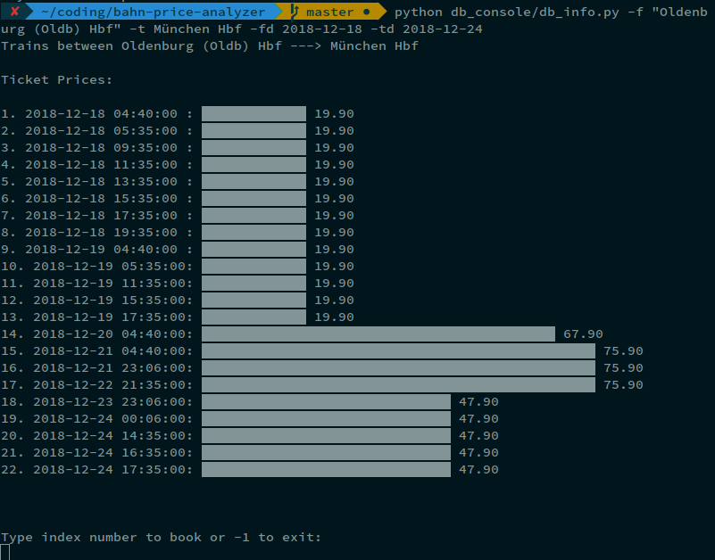
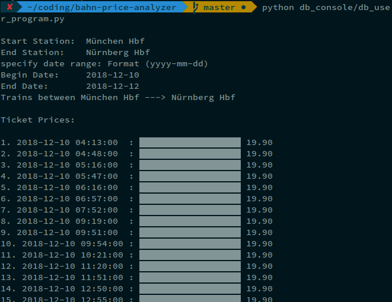

# bahn-price-analyzer
Analyzing the prices of the Deutsche Bahn (based on project [juliuste/db-prices](https://github.com/juliuste/db-prices))

Small terminal application for the given API.

# Requirements
1. [numpy 1.15.2](https://pypi.org/project/numpy/) 
2. [colorama 0.3.9](https://github.com/tartley/colorama)
3. [pandas v0.23.4](https://pypi.org/project/pandas/)
4. [Naked v0.1.31](https://github.com/chrissimpkins/naked.git)
5. [readline](https://pypi.org/project/readline/)

# Getting started
clone the directory and run 
1. `npm install`
2. setup aliases to run command from everywhere (WIP)

# Example commands
At the moment you can only specify the place by giving the exact station name, which can be found inside `stations.csv`. (still in progress, maybe we'll fix it with fuzzy matching)

`python db_console/db_info.py -f "Oldenburg (Oldb) Hbf" -t "München Hbf" -fd 2018-12-15 -td 2018-12-24`

## User program wrapper:

`python db_console/db_user_program.py`

# Node script
execute with `node scrapper.js -f from_station -t to_station -s start_date -e end_date`
 will write data into file: 

`data.csv`

# CSV file: data.csv
column names: date, hour, departure_time, arrival_time, stops, price, ticket_type, train_type

departure and arrival format:
'2017-06-05T08:53:00.000Z'

# Special Thanks
1. [Termgraph](https://github.com/mkaz/termgraph) by [makz](https://github.com/mkaz) for the amazingly simple terminal graph api.
2. [db-prices](https://github.com/juliuste/db-prices) by [juliuste](https://github.com/juliuste) for the db-price api which lets us fetch the ticket fares!
3. [Naked](https://github.com/chrissimpkins/naked.git) by [chrissimpkins](https://github.com/chrissimpkins) for the awesome library which lets us call our node script with ease!  

